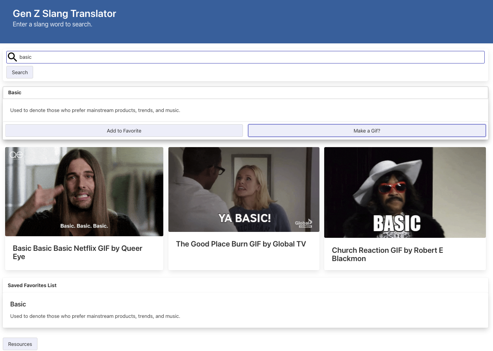

# Gen Z Slang Translator
Gen Z Slang Translator: Group Three - Project 1

## Description

A translator a program to help older generations understand what Gen Z is saying and then helps communicate through gifs. Users will be communicating with a Gen Z person and find they are unsure what they are trying to say. They will use our program to search the slang phrase with the search bar. The program will fetch slang phrases and definitions from Wikipedia and display the definition on the screen. The user can then click the “Make a Gif?” button to generate 3 gifs that will be fetched from the Giphy API using the search slang phrase. To help the user remember their favorite slang words, they will have the option to add them to their local favorite word bank.

### User Story
AS AN older generation
I WANT to translate what Gen Z is saying
SO THAT I can understand the new generation’s slang and effectively communicate through gifs..

### Acceptance Criteria
GIVEN the input from an user
WHEN I enter it into the search bar
THEN I am given a translation of the slang
WHEN I like the slang word
THEN I can add it to my personal favorite list
WHEN I am done reading the slang I can request a Gif
THEN a collection of Gifs are displayed
WHEN I like a Gif 
THEN I can save it to my favorite list

### Technologies used:
WikiTable API
Giphy API
Bulma

### Breakdown of tasks and roles
Bryan - HTML and Wiki API JavaScript
Anna - HTML, Bulma, and Giphy API
Matthew - boilerplate HTML

### Challenges
- We learned the limitations of the WIki API. the only way we could get the data from the table with the slang words would return the data in HTML and would not return JSON so we could not use the data.
- Issue with the page being updated so sometimes it would be updating when we were trying to fetch
- Using the correct parameters within the API URL links
- Unintentionally changed vital class names in Bulma code impacting the CSS
- Accidently pushed and merged keys.js

### Successes
- Discovery of WikiTable that will read the table data in the Wiki article we were using
- Wiki Table API is correctly displaying array items instead of a complex matrix
- Wiki and Giphy APIs working and successfully fetching data
- Solved tricky Git situations with patience and reading through the documentation

## Usage
Deployed URL: https://ahgeak.github.io/gen_z_slang_translator/ 
Repo URL: https://github.com/ahgeak/gen_z_slang_translator 

The user MUST enter a word that is included in the list on this Wikipedia page: https://en.wikipedia.org/wiki/List_of_Generation_Z_slang 

When the user enters a search word the word and definition will appear on the screen. The user will have the option to click the "Add to Favorites" button to save the word and definition to local storage and add it to the page. The user can also click the "Make a Gif?" button to generate 3 gif images. To learn about the resources used for this project the user can click the "Resources" button at the bottom of the page to see tools used in the creation of the project.

    

## Credits

Collaborators:
Anna Chuapetcharasopon - https://github.com/ahgeak
Bryan Chia - https://github.com/bryancz1493
Matthew Makowski - https://github.com/onlinematt

Anna and Bryan attended office hours to ask for support with the Wiki API from instructor Luigi and TA Daniel and both also attended tutoring sessions to work on rendering terms and definitions to the page and passing searched term to giphy API functions and local storage.

We used documentation from the mdn website at: https://developer.mozilla.org/en-US/

We reviewed lessons and practice exercises on W3Shools at: https://www.w3schools.com/

We read forums on StackOverFlow at: https://stackoverflow.com/

## License

This project uses an MIT License